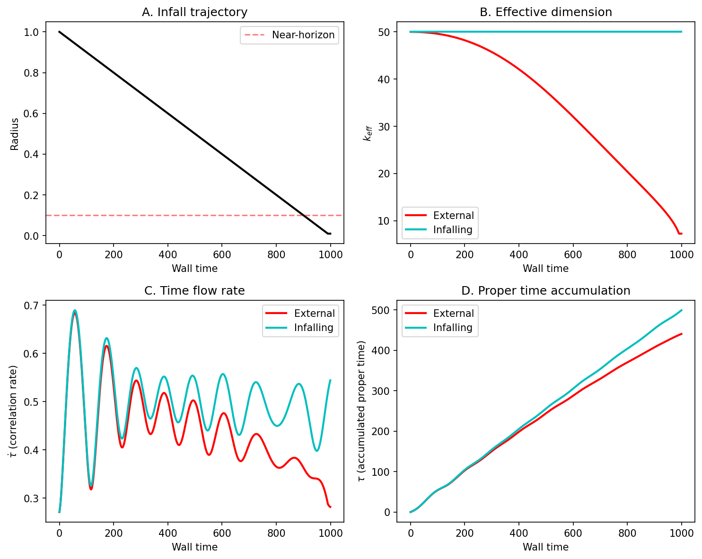

# Black Hole Phenomenology from Observer-Relative Apertures

**Time dilation, horizon effects, and complementarity emerge from dimensional accessibility constraints—no GR required.**

[](https://opensource.org/licenses/MIT)
[](https://www.python.org/downloads/)

## Overview

This repository demonstrates that black hole phenomenology can be reproduced using only:
- A high-dimensional dynamical system (coupled oscillators)
- Observer-relative apertures (which modes each observer can access)
- Time defined as correlation accumulation rate

**Key equation:** An observer's effective dimension is:

$$k_{eff} = \frac{(\sum_i w_i)^2}{\sum_i w_i^2}$$

where $w_i$ are aperture weights. When the aperture squeezes (approaching a horizon), $k_{eff} \to 2$, correlation rate $\dot{\tau} \to 0$, and time freezes—for that observer.

## Key Results

- **External observer** sees time freeze at horizon; **infalling observer** sees nothing special
- Same underlying dynamics, different apertures, different experienced time
- Thermodynamic cost (Landauer erasure) spikes at the horizon
- Merger simulations produce ringdown waveforms qualitatively matching LIGO observations



## Running the Simulation

```bash
cd code
python black_hole_aperture_sim.py
```

This generates four figures in `figures/`:
1. `fig1_time_dilation.pdf` - Time dilation during infall
2. `fig2_thermodynamics.pdf` - Accessible entropy and erasure cost
3. `fig3_ligo_connection.pdf` - Merger/ringdown simulation
4. `fig4_k_vs_radius.pdf` - Comparison to Schwarzschild

## The Four Observables

For each observer, we compute:

| Observable | Formula | Interpretation |
|------------|---------|----------------|
| $k_{eff}$ | Participation ratio of weights | Effective dimension |
| $S_{acc}$ | $\frac{1}{2}\log\det C$ | Accessible entropy |
| $\dot{\tau}$ | $\sqrt{\sum w_i \dot{x}_i^2}$ | Correlation rate (time flow) |
| $Q$ | $\sum \max(0, \Delta S_{erased})$ | Thermodynamic cost |

## Connection to GR

This doesn't derive GR—it shows that GR's phenomenology can emerge from aperture constraints:

- **Jacobson (1995)**: Einstein equations follow from thermodynamic consistency at horizons
- **This work**: Horizons are where aperture compression cost becomes extreme
- **Implication**: Spacetime geometry may be downstream of dimensional accessibility

## Connection to LIGO

Gravitational wave observations (inspiral → merger → ringdown) can be interpreted as:
- **Inspiral**: Gradual aperture contraction as systems approach
- **Merger**: Rapid aperture collapse
- **Ringdown**: Damped oscillations as aperture stabilizes

The ringdown spectrum encodes how fast dimensional access equilibrates.

## Paper

See `black_hole_aperture.tex` for the full writeup.

## Related Work

- [Time From Dimensions](https://coherencedynamics.com/blog/time-from-dimensions) - Blog post on aperture and time
- [Minimal Embedding Dimension](https://github.com/todd866/minimalembeddingdimension) - Formal treatment of dimensional constraints

## Citation

```bibtex
@misc{todd2025blackholeaperture,
  author = {Todd, Ian},
  title = {Black Hole Phenomenology from Observer-Relative Apertures},
  year = {2025},
  publisher = {GitHub},
  url = {https://github.com/todd866/black-hole-aperture}
}
```

## License

MIT License - see LICENSE file.
